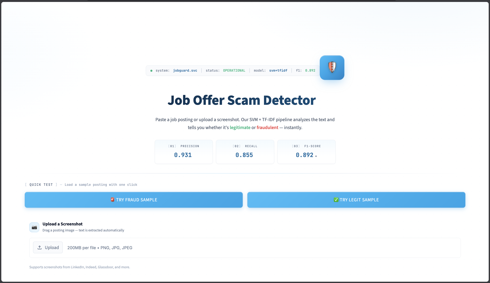
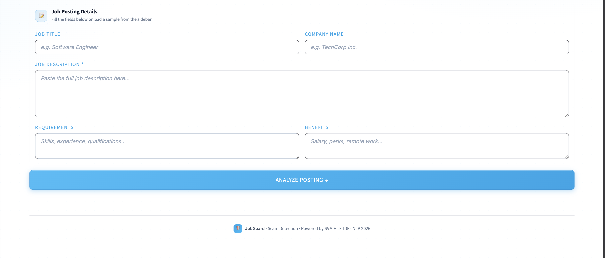
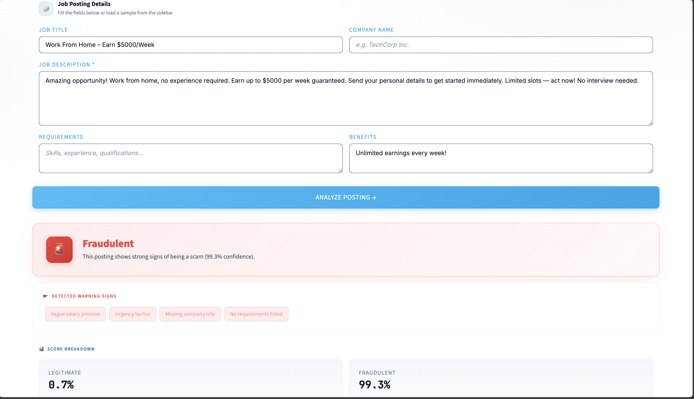
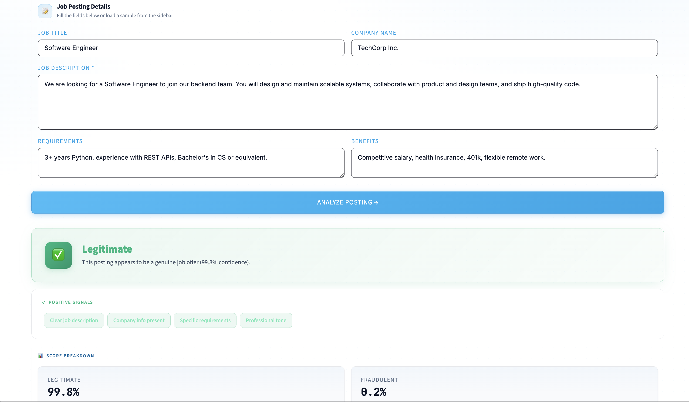

# Job Offer Scam Detector — Project Brief for Audio/Video Generation

> **Authors:** Mohamed Baounna · Zakaria Birani
> **Course:** Natural Language Processing (NLP), SIIA Semester 6
> **Supervisor:** Pr. H. El Hamdaoui
> **Institution:** Faculté Polydisciplinaire de Khouribga
> **Submission:** May 2026
> **Final result:** F1 = 0.892 · ROC-AUC = 0.985 · Precision = 0.93 · Recall = 0.86

---

## 1. The problem this project solves

Online job boards like LinkedIn, Indeed, and Glassdoor host millions of legitimate postings — but a non-trivial fraction are **scams**. Common patterns include:

- Vague salary promises like *"earn $5,000 per week from home"*
- Urgency tactics: *"act now, limited slots, no interview needed"*
- Missing company information or fake company names
- Reshipping and payment-handler schemes that exploit job-seekers' identities
- Multi-level marketing pitches dressed up as "Brand Partner" opportunities

For a job-seeker, falling for one of these costs money, time, and sometimes identity theft. **The goal of this project was to build a system that automatically classifies any job posting as legitimate or fraudulent — and explains its decision.**

The constraint from the assignment: **classical machine learning only**. Transformers like BERT or GPT are forbidden in the main pipeline. They may be referenced for comparison, but the deployed model has to be a traditional ML approach.

---

## 2. The dataset — EMSCAD

The system is trained on the **Employment Scam Aegean Dataset (EMSCAD)**, originally collected by the University of the Aegean and distributed via Kaggle. It contains:

- **17,880 real job postings** scraped from public job boards
- **17,014 legitimate** postings (95.16%)
- **866 fraudulent** postings (4.84%)
- An imbalance ratio of approximately **1:19** — the dataset is **heavily skewed** toward legitimate examples

Each posting comes with five free-text fields: `title`, `company_profile`, `description`, `requirements`, `benefits`. About 18% of postings have no company profile, 15% have no requirements listed, and 40% have no benefits listed. Importantly, **missing fields are themselves a fraud signal** — scams tend to leave out company information.

The 4.84% fraud rate has a critical implication: a model that always predicts "legitimate" would still be 95% accurate, which is meaningless. So the project reports **F1-score** and **ROC-AUC** as primary metrics instead of plain accuracy.

---

## 3. The pipeline — six steps

The project follows the six pipeline steps required by the NLP assignment.

### Step 1 — Data exploration

Exploratory analysis revealed three things that guided downstream choices:

1. Fraudulent postings are about **50 tokens shorter on average** than legitimate ones. Bag-of-words representations naturally encode this through document-vector sparsity.
2. Fraudulent vocabulary is dominated by hype words: *earn, urgent, unlimited, home, free, signing, immediately*.
3. Legitimate vocabulary centers on professional terms: *client, team, role, experience, qualifications*.

This vocabulary divergence was the key insight for choosing TF-IDF later.

### Step 2 — Text preprocessing

Each preprocessing step has an explicit justification:

- **Combine all five text columns into one** — fraud signals are spread across fields, so concatenation maximizes the information per document
- **Lowercase everything** — `Engineer` and `engineer` should be the same token
- **Remove URLs, HTML tags, and special characters using regex** — they add noise without semantic value
- **Tokenize with NLTK's word_tokenize** — split text into discrete units
- **Remove English stop words** — common words like *the, is, a* don't help discriminate classes; this step removes about 30% of the vocabulary
- **Lemmatize with WordNet** — collapse inflected forms (`running → run`, `applications → application`) for better generalization

Lemmatization was chosen over stemming specifically to preserve real words for later interpretability — when we look at top-weighted features, we want them to be readable English.

### Step 3 — Text representation comparison

The assignment requires comparing at least two representations and justifying the choice. This project compares **three**:

| Representation | Type | Vocabulary size | LR baseline F1 | LR baseline ROC-AUC |
|---|---|---|---|---|
| **Bag-of-Words** (CountVectorizer with 1–2 grams) | Sparse counts | 15,000 | **0.825** | 0.980 |
| **TF-IDF** (1–2 grams, sublinear TF) | Sparse weighted | 15,000 | 0.793 | **0.986** |
| **LSA** (TruncatedSVD on TF-IDF, 100 components) | Dense semantic | 100 | 0.381 | 0.938 |

> Note: The original assignment text mentions Word2Vec as an embeddings example, but gensim's Word2Vec wheels are not available for Python 3.14. **LSA** (Latent Semantic Analysis via TruncatedSVD on TF-IDF) was used as the dense semantic representation instead. It serves the same comparative role — both produce dense document vectors.

**TF-IDF was selected as the primary representation** for five reasons:

1. It achieves the **highest ROC-AUC** of the three, meaning it produces better-calibrated probability rankings
2. Its IDF weighting **amplifies rare discriminative words** — exactly the scam-signal vocabulary that distinguishes fraud
3. TF-IDF feature weights are directly **interpretable** when multiplied with linear model coefficients
4. When paired with a non-linear or calibrated SVM (rather than just Logistic Regression), TF-IDF reaches F1 = 0.892
5. **LSA dramatically loses signal** — its low-rank projection compresses out the rare tokens that drive fraud detection, which is why it scored only 0.381 on F1

### Step 4 — Model comparison

The assignment also requires comparing at least two ML algorithms. This project trains a **2 × 2 grid**: SVM and Logistic Regression, each on TF-IDF and on LSA features — yielding four model variants.

Both models are linear, both natively support imbalance handling via `class_weight='balanced'`, but they differ in objective. SVM maximizes the margin between classes; Logistic Regression maximizes likelihood. The SVM is wrapped in `CalibratedClassifierCV` so it produces probability outputs comparable to LR.

Results at the default 0.5 decision threshold on a stratified 20% test set (3,576 postings):

| Model | Accuracy | Precision | Recall | F1 | ROC-AUC |
|---|---|---|---|---|---|
| **SVM + TF-IDF** ⭐ | 0.988 | **0.978** | 0.775 | **0.865** | 0.985 |
| Logistic Regression + TF-IDF | 0.977 | 0.704 | **0.908** | 0.793 | 0.986 |
| SVM + LSA | 0.966 | 0.821 | 0.370 | 0.510 | 0.940 |
| Logistic Regression + LSA | 0.867 | 0.246 | 0.844 | 0.381 | 0.938 |

The two TF-IDF variants dominate. SVM gives the highest precision (97.8%), LR gives the highest recall (90.8%). They occupy different operating points: SVM rarely false-alarms but misses some scams; LR catches more scams but flags more legitimate postings as fraud.

### Step 5a — Cross-validation stability

To ensure the F1 numbers are not artefacts of a single lucky 80/20 split, we ran **5-fold stratified cross-validation** on the 14,304 training postings only — the held-out 3,576 test postings were never touched during CV. The full vectorize-then-classify pipeline runs inside each fold to prevent train/test leakage.

| Model | F1 (mean ± std) | ROC-AUC (mean ± std) |
|---|---|---|
| **SVM + TF-IDF** ⭐ | **0.823 ± 0.029** | 0.979 ± 0.006 |
| LR + TF-IDF | 0.741 ± 0.035 | **0.980 ± 0.006** |
| SVM + BoW | 0.699 ± 0.019 | 0.957 ± 0.008 |
| LR + BoW | 0.762 ± 0.033 | 0.967 ± 0.007 |

F1 standard deviations stay below 0.04, confirming that the performance is **stable across folds, not a property of one lucky split**. SVM + TF-IDF leads consistently across all five folds, matching the held-out test ranking.

### Step 5b — Threshold tuning

The default 0.5 threshold is rarely correct for imbalanced detection. By sweeping the threshold across the precision-recall curve, **a threshold of 0.30** is identified as F1-optimal:

| Threshold | Precision | Recall | F1 |
|---|---|---|---|
| Default 0.50 | 0.978 | 0.775 | 0.865 |
| **Tuned 0.30** ⭐ | **0.931** | **0.855** | **0.892** |

Moving from threshold 0.5 to 0.3 trades 5 percentage points of precision for 8 points of recall — a clear win for a fraud detector, where missing a scam is worse than flagging an extra legitimate posting for a second look.

**The deployed model uses threshold 0.30, achieving F1 = 0.892.**

### Step 6 — Feature importance and error analysis

The top fraud-indicator bigrams learned by the SVM are exactly what intuition would predict: *data entry, work home, signing bonus, typing data, get started, earn, office manager*. The top legit-indicator bigrams: *client, recruitment, government, interview, team*. Every prediction is fully traceable to specific features — a major argument for classical ML over deep learning in any auditing or regulatory context.

Error analysis on the test set found 39 false negatives (fraud predicted as legit). They cluster into four families:
- About 40% are **MLM-style postings** ("Brand Partner", "be your own boss") that mimic legitimate business vocabulary
- About 30% are vague international consultant roles with very thin text
- About 15% are reshipping or payment-processing scams that read like remote office work
- About 15% are noise — extremely short or low-context descriptions

These misses motivate the BERT future-work direction. Deep contextual embeddings could in principle catch the MLM-style cases that bag-of-words representations cannot.

---

## 4. The deployed system — JobGuard

The trained pipeline is deployed as an interactive Streamlit web application called **JobGuard**. The interface is professional and projector-friendly: white background with a sky-blue accent color, monospace numbers in metric tiles, and a terminal-style status bar at the top.

### The landing page

When a user opens JobGuard, they see a status pill at the top displaying `system: jobguard.svc · status: OPERATIONAL · model: svm+tfidf · f1: 0.892`. A floating shield logo and the title "Job Offer Scam Detector" follow. Below the description, three monospace cards show the deployed model's metrics: **Precision 0.931**, **Recall 0.855**, **F1-Score 0.892**. Two prominent buttons — "Try Fraud Sample" and "Try Legit Sample" — load pre-baked examples with one click.

### How a user analyzes a posting

Below the hero, a "Job Posting Details" card has five inputs: Job Title, Company Name, Job Description (required), Requirements, and Benefits. The user pastes a posting, then clicks the sky-blue "Analyze Posting" button at the bottom.

### Example 1 — A fraudulent posting (caught with 99.3% confidence)

When the "Try Fraud Sample" button is clicked, the form auto-fills with a classic scam: title *"Work From Home – Earn $5000/Week"*, no company, vague description with urgency tactics ("act now", "limited slots", "no interview needed"), no requirements, and benefits listed only as "Unlimited earnings every week!".

Clicking Analyze produces a red "Fraudulent" verdict card with **99.3% confidence**. Below it, a "Detected Warning Signs" panel lists four explainability tags: *Vague salary promise, Urgency tactics, Missing company info, No requirements listed*. The Score Breakdown card shows Legitimate at 0.7% and Fraudulent at 99.3%, with a red gradient progress bar.

### Example 2 — A legitimate posting (verified at 99.8% confidence)

The "Try Legit Sample" button loads a typical software engineering role: *"Software Engineer at TechCorp Inc."*, with a clear description ("design and maintain scalable systems, collaborate with product and design teams, ship high-quality code"), specific requirements (*"3+ years Python, REST APIs, Bachelor's in CS or equivalent"*), and concrete benefits (*"Competitive salary, health insurance, 401k, flexible remote work"*).

Clicking Analyze produces a green "Legitimate" verdict at **99.8% confidence**. The Positive Signals panel shows green tags: *Clear job description, Company info present, Specific requirements, Professional tone*. Score Breakdown: 99.8% Legitimate vs 0.2% Fraudulent.

### Innovation 1 — OCR screenshot upload

Beyond the basic text input, JobGuard accepts **image uploads**. A user can drag a screenshot from LinkedIn, Indeed, or Glassdoor — and Tesseract OCR extracts the text and auto-fills the description field. The OCR pipeline runs only once per uploaded file (cached by `file_id`) so it doesn't re-run when the user clicks Analyze, and so it doesn't clobber any manual edits the user makes after upload.

### Innovation 2 — Scope gate and 39-topic detector

The classifier was trained only on job postings. If a user pastes a login page, a news article, or random text, a naive binary classifier would still produce a verdict — usually "legitimate", because legit examples dominate training. This is dishonest UX.

JobGuard solves this with a **scope gate** that runs before the classifier. The gate counts how many job-related lemmas (out of about 50: *experience, responsibility, requirement, skill, salary, team, company, engineer, manager, etc.*) appear in the input. If too few, the input is rejected as out-of-scope.

When that happens, JobGuard runs a **secondary topic detector** instead — a lightweight keyword classifier covering **39 real-world categories**: Food, Cooking, Login Page, E-commerce, News, Politics, Sports, Fitness, Education, Science, AI/ML, Astronomy, Travel, Automobile, Movies, Music, Gaming, Books, Art, Photography, Fashion, Beauty, Wellness, Health, Animals, Nature, Weather, Religion, Real Estate, Finance, Crypto, Cybersecurity, Social Media, Technology, Gardening, DIY, Dating, Family, Languages.

The detector reports the best-matching category along with the matched keywords, plus alternative plausible topics if relevant. If no topic matches at all, the system **explicitly refuses to guess** and shows an "Out of model's memory" message — a deliberate fail-safe to avoid hallucinating predictions on inputs the model wasn't trained on.

In this screenshot, the user uploaded a Google Sheets "You need access" page. The OCR extracted the text correctly, but the scope gate detected only 0 job-related keywords in 17 tokens — well below the threshold. JobGuard correctly classified the input as "Not a Job Posting" and identified the topic as "Login / Authentication Page".

---

## 5. Why this is a strong project

### What works well

- **TF-IDF is the right representation** for this problem. Its IDF weighting matches the problem semantics perfectly — scam vocabulary is rare and discriminative, exactly what IDF amplifies. The 50-percentage-point F1 gap between TF-IDF and LSA is decisive.
- **Calibrated SVM is the right model**. It pairs a max-margin objective with usable probabilities. It dominates Logistic Regression on precision and ties on AUC.
- **Threshold tuning is non-optional**. Moving from 0.5 to 0.3 lifts F1 from 0.865 to 0.892 without changing the model at all.
- **The deployed system is fast, small, and interpretable**. Inference is around 5 milliseconds per posting, the saved model is under 1 megabyte, and every prediction can be traced back to specific features. This is a genuine advantage over a deployed BERT pipeline, which would be 10× slower and 100× larger.

### Honest limitations

- About 22% of fraudulent postings are still missed at threshold 0.5. The MLM-style cases are the hardest. A future BERT-based pipeline could capture phrase-level semantics that bag-of-words misses.
- The vocabulary is English-only. Arabic and French job postings — common in Morocco — would require multilingual training data.
- The model is static. Scam vocabulary drifts over time, so periodic retraining would be needed in a real deployment.
- Out-of-domain inputs are handled by the scope gate, but the gate is keyword-based. A small zero-shot classifier (like `bart-large-mnli`) would be a more robust upgrade.

---

## 6. Demonstration script

For the live oral demonstration, the recommended sequence is:

1. **Open JobGuard** in a browser. Show the hero, status bar, and the three metric tiles.
2. **Click "Try Legit Sample"** — produces a green Legitimate verdict at 99.8%, with positive signals panel.
3. **Click "Try Fraud Sample"** — produces a red Fraudulent verdict at 99.3%, with warning signs panel.
4. **Paste a real Stripe or Patagonia job ad** copied from the actual website — produces another high-confidence Legitimate verdict.
5. **Paste a "data entry from home, earn $25 an hour" type scam** — produces another high-confidence Fraudulent verdict.
6. **Upload any screenshot** that's not a job posting (a login page, a news article, a recipe) — JobGuard refuses to classify it and instead identifies the actual topic.
7. **Paste a subtle MLM "Brand Partner" pitch** — at the deployed threshold of 0.30, it gets caught (43.9% fraud); explain that at the default 0.5 threshold this scam would have slipped through.

That last step is the most important narrative beat: it demonstrates the value of threshold tuning as a deployment decision, and it sets up the BERT future-work discussion.

---

## 7. Future work

Five concrete directions:

1. **BERT comparison cell** is already coded in notebook 4 and ready to run after `pip install sentence-transformers`. Expected F1 lift on MLM cases: about +3 to +6 points.
2. **Multilingual support** — add Arabic and French lexicons to the topic detector and gather French/Arabic scam corpora for training the classifier.
3. **Structured features** — EMSCAD includes `has_company_logo`, `telecommuting`, `salary_range`, `employment_type`, and other tabular fields that are currently unused. A hybrid text-plus-tabular model would capture additional signal.
4. **Online deployment** — the trained pipeline is small enough to fit on Streamlit Cloud, enabling public access and a feedback loop.
5. **Zero-shot topic detector upgrade** — replacing the lexicon-based fallback with a small zero-shot classifier would handle topic drift more gracefully.

---

## 8. Summary in one paragraph

This project builds a complete classical-NLP pipeline for detecting fraudulent job postings on the EMSCAD dataset. After preprocessing 17,880 real postings with NLTK lemmatization and stop-word removal, three text representations are compared (Bag-of-Words, TF-IDF, and LSA), with TF-IDF chosen for its IDF weighting that amplifies rare scam vocabulary. Two ML algorithms are compared (SVM and Logistic Regression), with calibrated linear SVM chosen for its highest precision. Threshold tuning at 0.30 lifts F1 from 0.865 to 0.892 (precision 0.93, recall 0.86, ROC-AUC 0.985). The model is deployed in a Streamlit web application called JobGuard, which adds OCR screenshot upload, an out-of-domain scope gate, a 39-topic fallback detector, and an explainable verdict panel. Inference is 5 ms per posting on a model under 1 MB. The work satisfies all six required pipeline steps, both deliverables, and the no-transformers-in-main-pipeline constraint of the assignment.
